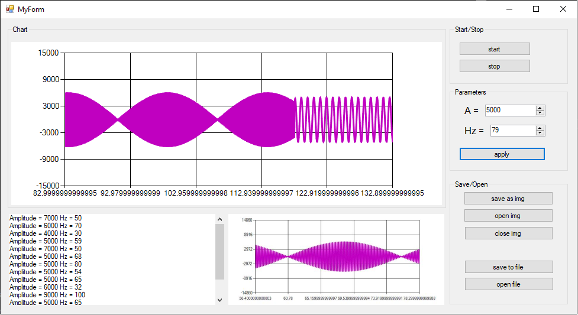

# sinusoidal_chart_app
builds sinusoidal signal dynamic graph, a user can change apmplitude and frequency, can save it as image, open the image and close it in the app, can save data into txt file, can also open the file for reading in the app, zoom in zoom out the graph by mousewheel.

Программа, которая выводит на динамический (изменяется с течением времени) график синусоидальный сигнал с определенной частотой и амплитудой, которые можно изменять. Cохранение отображенных на графике данных в файл с последующей возможностью открыть этот файл в данной программе для просмотра и анализа. Возможность масштабирования графика с помощью колёсика мыши, элементы управления для возможности задания частоты и амплитуды сигнала. Задание частоты и амплитуды сигнала при помощи ввода числовых значений в поля и применение новых значений по нажатию кнопки «применить». Диапазон значений для частоты от 1 Гц до 100 Гц. Диапазон значений для амплитуды от 100 до 10000. Запуск или остановка графика по нажатию кнопок «старт» и «стоп» соответственно. Сохранение или открытие файла по нажатию кнопок «сохранить» или «открыть».
